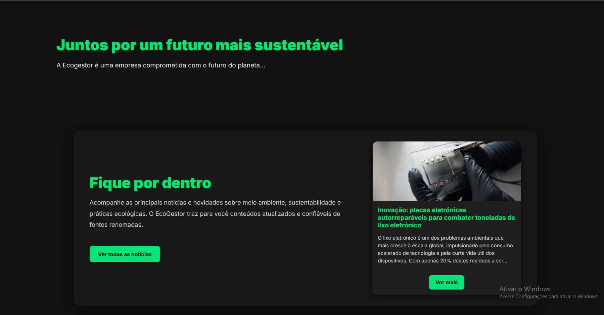
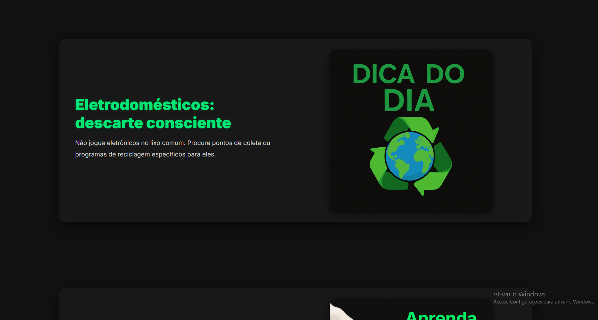
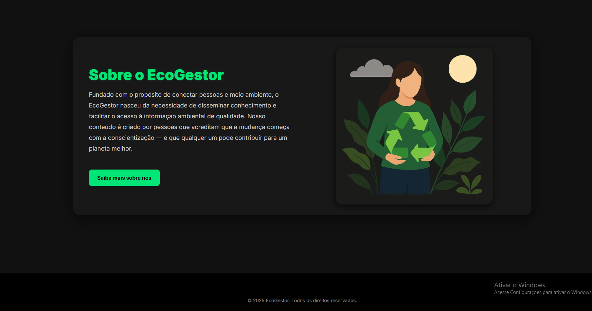
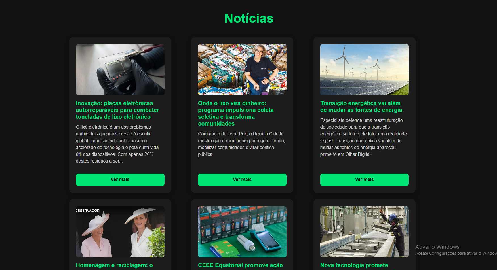
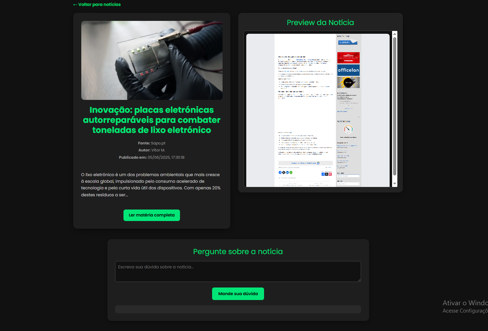
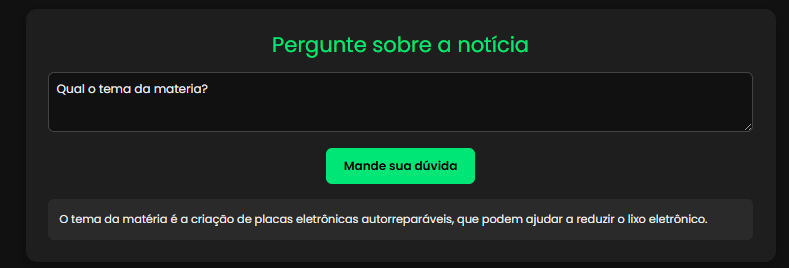
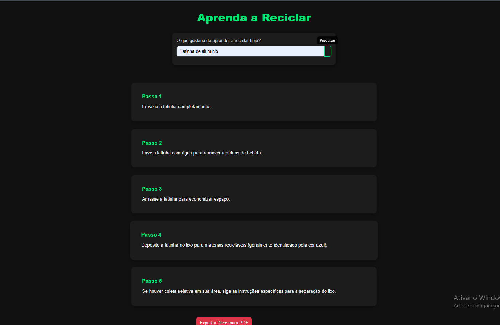
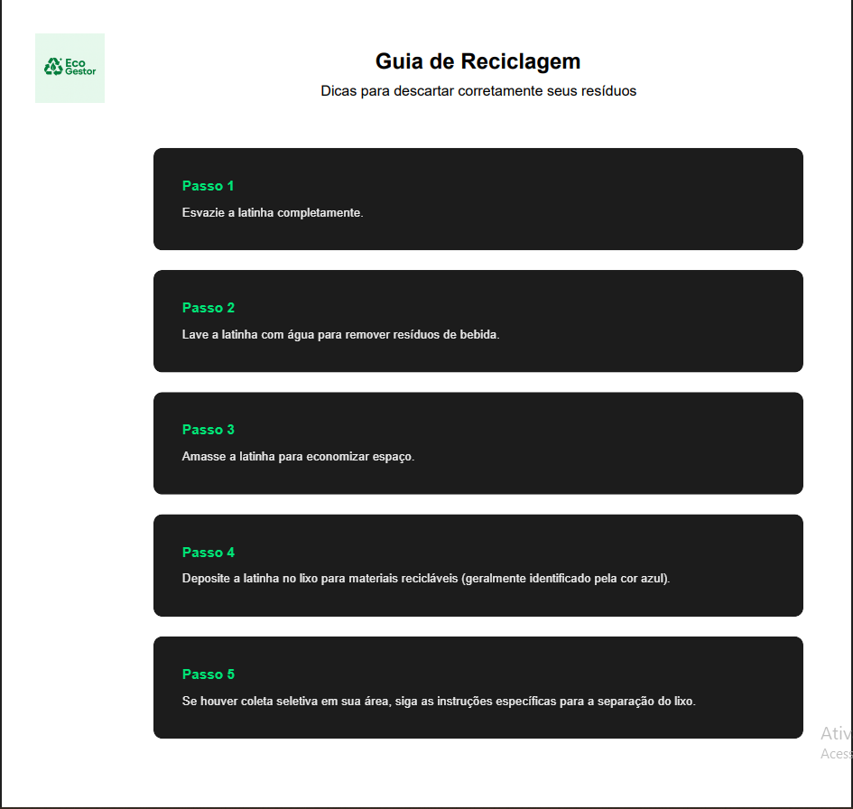
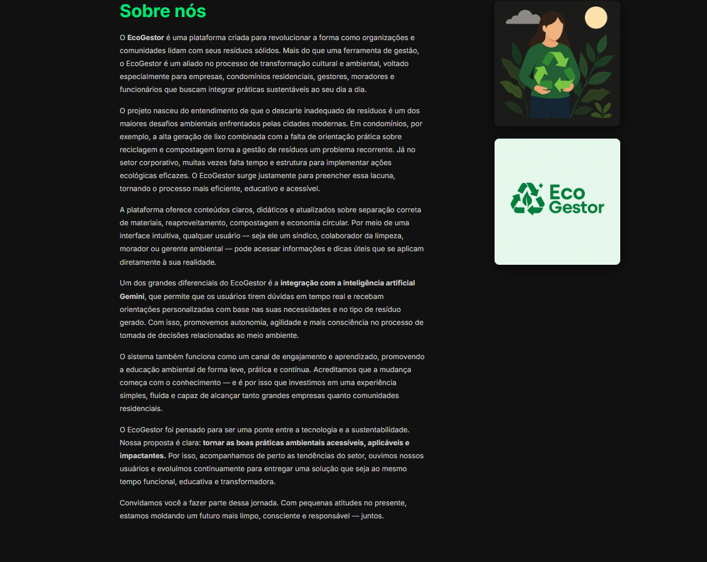

# 5. Interface do Sistema

_Visão geral da interação do usuário por meio das telas do sistema. Apresente as principais interfaces da plataforma._

## 5.1. Carrossel Principal do Sistema

## 5.2. Tela Home

## 5.3. Tela de Notícias

## 5.4 Tela de Detalhe das Notícias

### 5.4.1 Resposta da IA a uma pergunta:

## 5.5 Tela de Aprenda Reciclar

### 5.5.1 PDF gerado com as dicas

## 5.6 Tela Sobre

